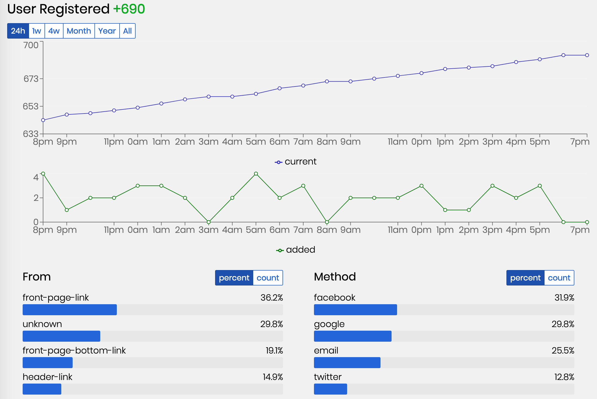
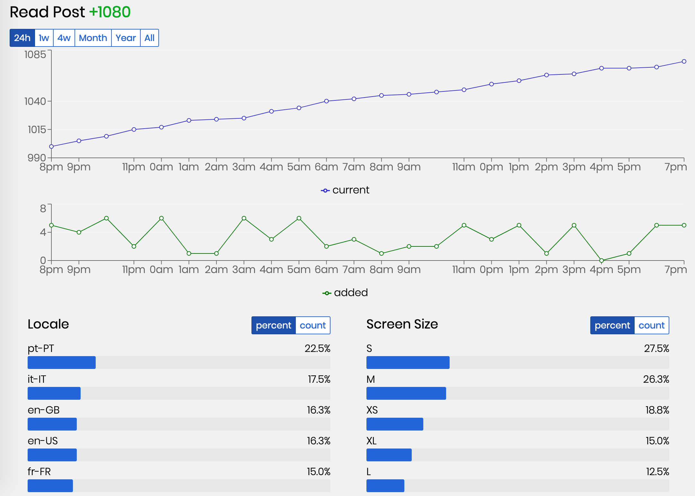
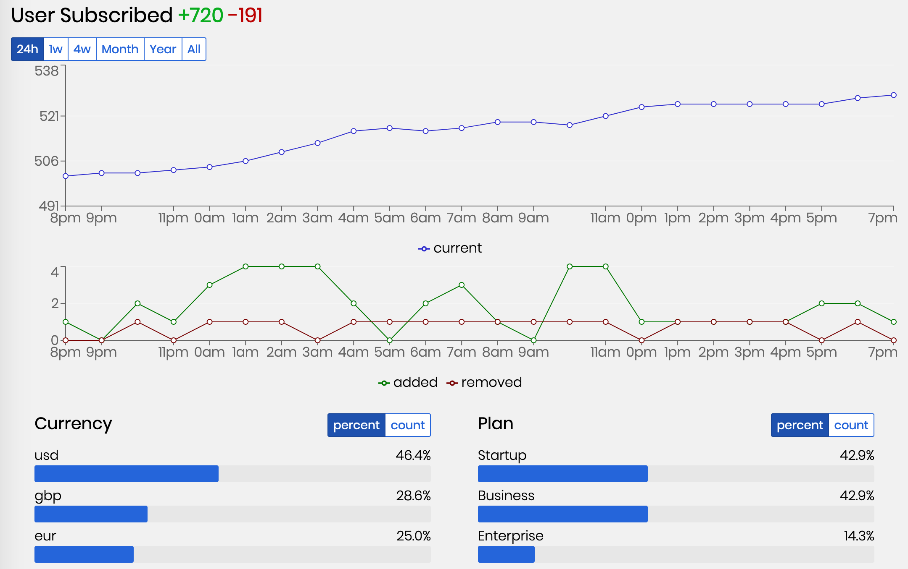

# Insights-js

This repository contains the official javascript wrapper for https://getinsights.io.

This library allows you to track events in the browser and see them aggregated in our admin interface.

## Getting Started

### With npm or yarn:

You can just install from npm or yarn, typescript definitions are included in the base package:

```sh
npm install insights-js
```

Then import as a `commonjs` module:

```js
const { init, track, parameters } = require("insights-js")
```

Or as an `es6` module:

```ts
import { init, track, parameters } from "insights-js"
```

And track something:

```js
// Initialize for your project, you can find this on your dashboard
init("XkJsfa5KasGf9W_8")

// ...

// track something
track({
  id: "user-subscribed",
  parameters: {
    plan: "Startup"
  }
})
```

### With the umd build

```html
<script src="https://unpkg.com/insights-js"></script>

<script>
  // Initialize for your project,
  // you can find this on your dashboard
  init("XkJsfa5KasGf9W_8")

  // ...

  // track something
  track({
    id: "user-subscribed",
    parameters: {
      plan: "Startup"
    }
  })
</script>
```

## Guides

### Tracking simple events

Just call `track()`

```js
track({
  id: "user-registered",
  parameters: {
    method: "google",
    from: "top-link"
  }
})
```

Here is the result in the dashboard:


### Custom parameters

`insights-js` ships with multiple built-in parameters, to track values that are often useful, use as follow:

```js
import { parameters } from "insights-js"

track({
  id: "read-post",
  parameters: {
    // this will track the locale of the user, useful to know if we should translate our posts
    locale: parameters.locale(),
    // this will track the type of screen on which the user reads the post, useful for useability
    screenSize: parameters.screenType()
  }
})
```

Result in the dashboard:


See the full list [in the parameters'API documentation](#parameters).

### Untracking events

Certain events last through time and may be undone or cancelled after they have been logged.
For example, when tracking subscription to services or people.

For these events, it is very useful to be able to know:

- When an event is tracked
- When an event is marked as cancelled
- The current number of active (`tracked - cancelled`) events

When this flag is set to `true`, the given event is marked as cancelled.

e.g:

```js
// A user just subscribed!
track({
  id: "user-subscribed",
  parameters: {
    plan: "Startup"
  }
})

// A user unsbubscribed.
track({
  id: "user-subscribed",
  parameters: {
    plan: "Startup"
  },
  remove: true
})
```

Here is the result in the dashboard:


### Tracking page views

TODO

### Tracking on multiple projects

The calls to `init()` and `track()` are wrappers are methods on the `App` class.
You may instantiate any use one app per project - with or without the default App:

```js
import { App } from "insights-js"

// equivalent to init("project-1-id")
const app1 = new App("project-1-id")
const app2 = new App("project-2-id")

// will show up in project 1's dashboard
app1.track({
  id: "user-registered",
  parameters: {
    method: "google",
    from: "top-link"
  }
})

// will show up in project 2's dashboard
app2.track({
  id: "read-post",
  parameters: {
    // this will track the locale of the user, useful to know if we should translate our posts
    locale: parameters.locale(),
    // this will track the type of screen on which the user reads the post, useful for useability
    screenSize: parameters.screenType()
  }
})
```

## API

See the detailed API documentation [in the docs folder](./docs/README.md).

### `init(projectId, options)`

```ts
init(projectId: string, options?: InitOptions): void
```

#### arguments

`projectId: string`
_Mandatory_
The projectId to track this event with, you can find this in the page of your project

`options?: AppOptions`
_Optional_
_Default value:_ `{}`

`options.ignoreErrors: boolean`
_Optional_
_Default value:_ `false`
When set to `true` any error that may occur when tracking events will be ignored. It is reccomended to set this flag to `true` on production.

`options.disabled: boolean`
_Optional_
_Default value:_ `false`
When set to `true`, all calls are disabled.
This flag is useful to disable the tracking based on the environment or URL.

### `track(event)`

```ts
track(event: Event): Promise<void>
```

**arguments**

`event: Event`
_Mandatory_
The event to track

`event.id: string`
_Mandatory_
The id of the event to track, should be a human readable id in `kebab-case`.

`event.parameters: { [key: string]: string }`
_Optional_
_Default value:_ `{}`
A map of `(key: string) -> (value: string)` pairs.
Getinsights keeps track of the number of events logged for each value.
You may also use the `parameters` variable to generate built-in values.
See the full list [in the parameters'API documentation](#parameters).

`event.unique: boolean`
_Optional_
_Default value:_ `false`
When true, check if a similar event (i.e. same id & same parameters), has already been logged **with the unique flag** in this session.
If a similar event has already been logged, it skips it.

`event.remove: boolean`
_Optional_
_Default value:_ `false`
Certain events last through time and may be undone or cancelled after they have been logged.
For example, when tracking subscription to services or people.

For these events, it is very useful to be able to know:

- when an event is tracked
- when an event is marked as cancelled
- the current number of active (`tracked - cancelled`) events.

When this flag is set to `true`, the given event is marked as cancelled.

**Examples:**

```js
import { track, parameters } from "insights-js"

// user signed up with their email/password
track({
  id: "user-signed-up",
  parameters: {
    provider: "email"
  }
})

// user signed up with facebook
track({
  id: "user-signed-up",
  parameters: {
    provider: "facebook"
  }
})

// a product was sold
track({
  id: "product-sale",
  parameters: {
    product: product.name,
    currency: customer.currency
  }
})

// a page was opened
track({
  id: "open-page",
  parameters: {
    path: parameters.path(),
    screenType: parameters.screenType(),
    referrer: parameters.referrer()
  }
})
```

### `trackPage(options)`

```ts
trackPage(options?: TrackPageOptions): TrackPageResult
```

TODO

**arguments**

### Parameters

#### `parameters.locale()`

Gets the `locale` of the current user, for example: `en-US`, `pt-BR` or `fr-FR`.

#### `parameters.screenType()`

Gets the type of screen the user is currently on, possible return values:

- `"xs"` if `screen width <= 414px`: Mobile phone
- `"s"` if `screen width <= 800px`: Tablet
- `"m"` if `screen width <= 1200px`: Small laptop
- `"l"` if `screen width <= 1600px`: Large laptop / small desktop
- `"xl"` if `screen width > 1600px`: Large desktop

#### `parameters.referrer()`

Gets the referrer of the user.

For example `"https://google.com"` if the user came from Google.

#### `parameters.path(hash, search)`

```ts
path(hash?: boolean, search?: boolean)
```

Gets the current path (segment of the URL after the domain) of the user.

`hash?: boolean`
_Optional_
_Default value:_ `false`
When `true`, also returns the hash segment of the URL.

`search?: boolean`
_Optional_
_Default value:_ `false`
When `true`, also returns the search segment of the URL.

## License

MIT
